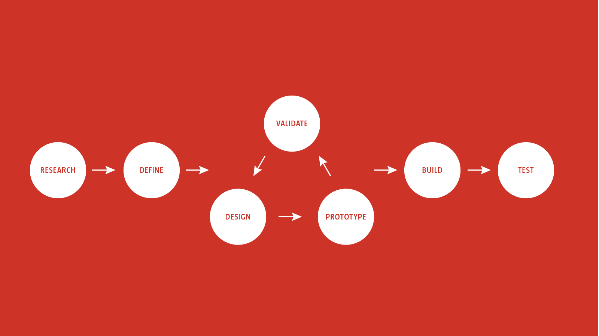

UX Foundations
==============

**Initial Outline: Tuesday, 17 April, 2017**

**Before I get into the outline, I think it's important that the book acknowledges that we are now designing for a multi-device landscape that encompasses: desktop, mobile, wearable…**

**It should also touch on (but not get lost in) conversational UIs and what lies ahead: Alexa, Siri…**

Overview
--------

This book is intended as a beginners to intermediate introduction to User Experience (UX) design. It’s the ‘missing manual’ I’ve been looking for at Belfast School of Art.

I recommend lots of books on my undergraduate Interaction Design programme, each focused on a different aspect of UX, what I really need, however, is **a book that provides a holistic overview of UX**.

The book is design-focused, it’s about the process of user experience design from a designer’s perspective. It will touch on build aspects (web, mobile), but it’s primarily about the process of design.

In addition to students new to UX this book could also serve as the basis for graphic designers – and others – wishing to transition into UX design.

We could perhaps serialise the book for Smashing Magazine’s membership, so that we get the maximum benefit from the content. (I could take care of the serialisation, breaking the content down.)

I’d redraw all the diagrams and develop them. We might approach the book like my first [Standardistas’](https://amzn.to/2HgsYt3) book, with a section after each chapter of suggested reading, possibly downloadable templates, printables, etc..

In addition to the core book we could explore additional worksheets – similar to those I designed for Tiny Books, [like this](https://www.dropbox.com/s/v16c8urdh5satho/ux-worksheets-like-this.pdf?dl=0), but Smashing Magazine branded – so that there was a sense that this was **more than a book….**
 

- - -

Book Structure
--------------

I’m exploring the idea of structuring the book around a typical design process:

+ Research
+ Design
+ Prototype
+ Build
+ Test

This feels like a logical structure (and I can’t recall seeing it done before). It echoes some of what I’ve begun to explore in the original series of articles for Smashing Magazine + Adobe XD.

I’ll develop a full table of contents shortly; what’s included below, is just me thinking aloud.

- - -

Table of Contents
-----------------

**This is a very rough, incomplete draft. It’s designed to get the ball rolling and I’ll be working on it this week.**

+ **Foreword**

+ **Acknowledgements**

+ **Introduction**

+ **Chapter 1: Research**
  + The ‘U’ in UX Design
  + A User-Centred Approach
  + Users = Humans
  + Defining the Problem
  + Competitor Benchmarking
  + Research Methods
    + Quantitative
    + Qualitative
  + Research Outputs
  + Drawing Conclusions
  + Analysing Research Findings
  + Triangulation

+ **Chapter 2: Design**
  + Research → Hypothesis
  + User Stories
  + Personas
  + Information Architecture
  + Design Principles
  + Idea Generation
  + Better Design Deliverables
  + Moodboards
  + Style Tiles and Element Collages
  + An Iterative Approach

+ **Chapter 3: Prototype**
  + Fidelity: Low → Medium → High
  + Tools: Paper; Digital
  + Wireframing
  + Macro-Prototyping (Flow)
    + Adobe XD
    + InVision
    + Etc.
  + Micro-Prototyping (Micro-Interactions)
    + Keynote
    + PowerPoint
    + Etc.

+ **Chapter 4: Build**
  + HTML, CSS, JS
  + Design Systems
  + /* This section needs work. This is a beginners to intermediate book, not an ‘everything you need to know about HTML, CSS and JS’ book, so I need to think about what goes into ‘Build’. */

+ **Chapter 5: Test**
  + A Culture of Critique
  + Usability Testing
    + A User Testing Script
    + Running a Test
    + Tools (Screenflow, etc.)
  + Implementing Your Findings
  + Post-Launch Strategy

+ **Conclusion**

+ **Required Reading**

+ **Colophon**

- - -

Foreword
--------

A foreword helps give the book a seal of approval and it’s useful for spreading the word. (I could ask Brad Frost…?)

Whoever we approach we should stress that everything in the book is drawn from 15 years of teaching that has been informed by 25 years of hands-on experience in industry.

We should maybe also mention that I’m a Senior Fellow of the UK’s Higher Education Academy (SFHEA), i.e. that my teaching has been recognised as world class.

- - -

Acknowledgements
----------------

Be sure and credit folks who’ve helped:

1. The folks at Smashing: Markus Seyfferth, Rachel Andrew, Iris Lješnjanin, etc. (Plus Vitaly Friedman, of course!)

2. The folks at Adobe: Mike Hu, Amanda Gross Tuft and Liz Hemingway.

3. The team at Belfast School of Art: Paul McCormack, Kyle Body, VLs.

4. The team at Little Thunder: Tim Potter and Gaby Muldoon.

3. Others who have provided feedback on my initial proposals: @richardreddy, @bitka, etc..

- - -

Introduction
------------

Why UX? Why now? Why me?

Almost a decade ago I co-authored a book on [Web Standards Design](https://amzn.to/2HgsYt3) with my Standardistas partner-in-crime, Nicklas Persson. It was the missing textbook we needed for my teaching at Belfast School of Art.

Things have moved on – as they inevitably do in our industry – and, once again, I’m looking for a textbook. This time one that introduces the fundamentals of User Experience (UX) design, from research right through to designing, building and testing.

The introduction should be an expansion of article one in my Adobe XD series. It’s designed to set the scene and stress the importance of UX design in the here and now.

It’s about competitive advantage, why design-driven companies deliver higher profits, the rise of the Chief Design Officer (CDO), etc..

The introduction should also highlight who the book is targeted at: anyone studying UX (stress that it’s been thoroughly road-tested on my students at Belfast School of Art); anyone moving into UX.

/* Perhaps reference some of Adobe’s statistics that explain why design is being embraced by industry and why user experience, in particular, is driving and disrupting industry. */

<!-- Functional, Aesthetic, Experiential -->

- - -

Chapter 1: Research
-------------------

This section is critical. It’s about aligning everything you do with your users’ needs. It’s about the ‘U’ in UX. It also stresses the fact that users are humans (i.e. not some abstract concept, ‘users’).

We need to stress that design flows from the problem and that we can define the problem effectively if we create a research toolbox comprised of both quantitative and qualitative methods.

I’d suggest I outline a number of different user research methods, tools that readers can use to inform their design. We might also include links to downloadable worksheets for these tools so that the book feels rounded.

It would be nice to have worksheets ([likethis](https://www.dropbox.com/s/v16c8urdh5satho/ux-worksheets-like-this.pdf?dl=0) – branded with Smashing’s cat – similar to the ones I’ve been doing for Tiny Books. This frames the book as one part of a learning system, which might also include slide decks?

- - -

Chapter 2: Design
-----------------

This section is about mapping everything learned in the research phase onto the design phase. It’s about establishing a hypothesis informed by your findings.

I’ll explain what user stories are and why they help to keep the user at the heart of the design process. I’ll also introduce some design principles: visual grammar, language (and content design), typography, narrative, psychology….

I’d suggest we look at information architecture and structuring design at the macro-level, looking at user flows. Lastly, I’ll stress that designing for screens is not the same as designing for print. This point is critical.

- - -

Chapter 3: Prototype
--------------------

I think we should widen the scope here, beyond the restriction to Adobe XD that the Adobe sponsored articles imposed, i.e. include more than just Adobe XD, also include, e.g. InVision, Keynote, etc..

+ Lo-fi Prototypes
+ Wireframes
+ UI, UI Kits
+ Animation

- - -

Chapter 4: Build
----------------

This chapter feels a little out of place for a high level book… Are we talking about high fidelity prototypes here? In this context, perhaps? Although I could also touch on a cross-section of tools designers can use to build immersive prototypes. (Except that’s covered in the chapter before….) 

Be careful this doesn’t get too lost in detail. Remember this is a beginning to intermediate book, not an ‘everything you need to know about HTML, CSS and JS’ book.

- - -

Chapter 5: Test
---------------

Again, this draws on the Smashing + Adobe articles.

- - -

Suggested Reading
-----------------

+ [Lean UX: Designing Great Products with Agile Teams](https://amzn.to/2JCfFS1)

+ [Sprint: How to Solve Big Problems and Test New Ideas in Just Five Days](https://amzn.to/2JDt9gH)

+ [Giles Colborne: Simple and Usable](https://amzn.to/2IKFxKr)

<!-- Test these links before submitting. Also, it might be an idea to have a required reading section at the end of each chapter? -->

